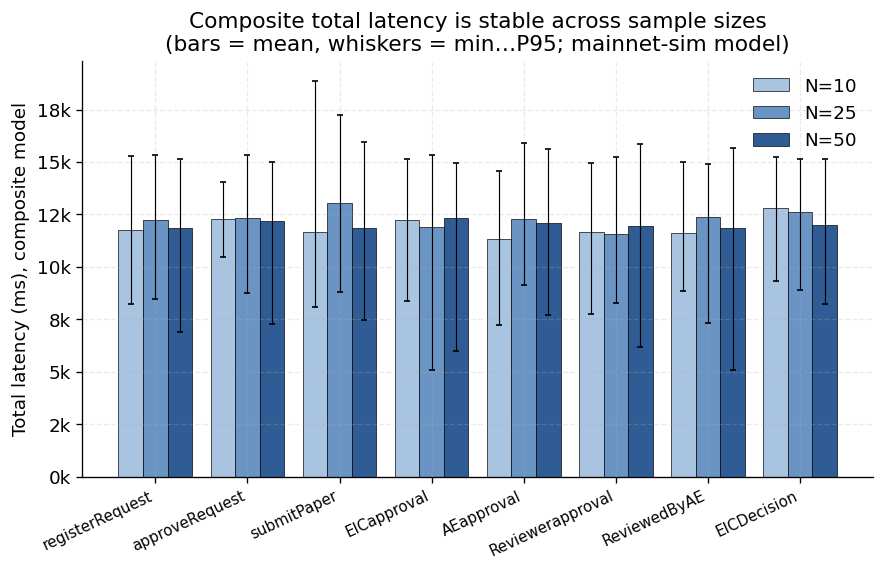
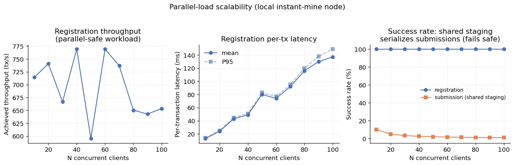

# Benchmark Report

_Generated: 2026-07-11T12:12:59.055Z · network: sepoliaFork_

## Methodology

Measurements run on the in-process Hardhat network in two passes: a **local** pass (fast, offline) and a **sepoliaFork** pass that forks real Sepolia state at the pinned block (see README / CHANGELOG). The EVM is deterministic, so gas-per-operation is identical across both — the fork validates the local numbers against real-network parameters rather than changing them. Latency, throughput, and scalability depend on block cadence and gas limit (12.242s block interval, 30,000,000 gas/block).

Sections 1–3 and the lifecycle are **dual-network** (`local` + `sepoliaFork` row-blocks); their per-operation gas tables are byte-for-byte identical across networks (Section 1, and `figures/gas_network_compare.png`), so the local measurements equal the real-Sepolia-state ones. Sections 4–7 are **local-only by design** — see the note in each. Tables are network-independent wherever gas-derived; wall-clock columns reflect local execution and are not cross-network meaningful. (This pass ran on `sepoliaFork`.)

Every CSV in this directory carries a `network` column with one row-block per network; the figures (`figures/`) compare them. Sections run independently via `npm run benchmark:<section>`; both networks via `npm run benchmark:all-networks`.

## 1. Gas per operation

### Deployment

| Contract | Gas used |
|---|---:|
| Auth | 3,078,225 |
| Main | 5,608,132 |
| Decision | 2,332,648 |

### Auth operations

| Operation | Gas used |
|---|---:|
| addJournalDirect | 299,014 |
| requestMember | 303,838 |
| approveRequest | 308,335 |
| denyRequest | 73,448 |

### Main + Decision pipeline

| Operation | Gas used |
|---|---:|
| getPaperInfo | 282,499 |
| sendToEIC | 363,444 |
| EICapproval | 655,519 |
| AEapproval | 655,497 |
| Reviewerapproval | 912,355 |
| ReviewedByAE | 477,427 |
| decisionGetPaperInfo | 745,362 |
| EICDecision | 864,967 |

## 2. Latency under Sepolia-like 12s blocks

Each row is 5 samples on an in-process node with interval mining at 12.242s.

| Operation | Samples | Mean (ms) | Min (ms) | Max (ms) |
|---|---:|---:|---:|---:|
| request | 5 | 12870 | 12227 | 15157 |
| approve | 5 | 14019 | 12240 | 15235 |
| submit | 5 | 25995 | 24256 | 27189 |
| EICapproval | 5 | 14035 | 12471 | 15404 |
| EICDecision | 5 | 26997 | 24719 | 27677 |

Raw data: [latency.csv](./latency.csv)

## 3. Throughput

### Analytical (Sepolia 30M gas/block, 12s/block)

Theoretical upper bound assuming a block contains only that operation.

| Operation | Gas | Ops/block | TPS |
|---|---:|---:|---:|
| addOrRequestMember | 303,838 | 98 | 8.01 |
| approveRequest | 308,335 | 97 | 7.92 |
| getPaperInfo | 282,499 | 106 | 8.66 |
| sendToEIC | 363,444 | 82 | 6.7 |
| EICapproval | 655,519 | 45 | 3.68 |
| AEapproval | 655,497 | 45 | 3.68 |
| Reviewerapproval | 912,355 | 32 | 2.61 |
| EICDecision | 864,967 | 34 | 2.78 |

### Empirical (local instant-mine sanity check)

- Operation: `submission (getPaperInfo + sendToEIC)`
- Submissions: 100 (two txs each)
- Blocks consumed: 200
- Wall-clock: 756 ms
- Local TPS (instant-mine, no block-time floor): 132.28

Raw data: [throughput.csv](./throughput.csv)

## 4. Scalability

Full Auth->Main->Decision pipeline run for N papers.

> **Local-only, valid cross-network.** This sweep is run on the local network only. Its reported metrics (`totalGas`, `meanGasPerPaper`) are gas-derived, and Section 1 proves per-operation gas is byte-for-byte identical between `local` and `sepoliaFork`. Gas is EVM-deterministic, so a sum of identical per-op costs is itself identical — the fork would reproduce these numbers exactly. Only wall-clock differs, which on a fork measures the harness (block production is harness-controlled), not the network, so it is not a meaningful cross-network metric.

| N | Total gas | Mean gas / paper | Wall-clock (ms) | Mean ms / paper |
|---:|---:|---:|---:|---:|
| 1 | 4,957,070 | 4,957,070 | 14 | 14 |
| 10 | 48,309,971 | 4,830,997 | 209 | 21 |
| 50 | 240,998,971 | 4,819,979 | 930 | 19 |
| 100 | 481,853,221 | 4,818,532 | 1,874 | 19 |
| 500 | 2,408,731,221 | 4,817,462 | 10,829 | 22 |

Raw data: [scalability.csv](./scalability.csv)

## 5. State-growth scalability

For each K, the relevant data structure is pre-seeded with K entries (distinct synthetic addresses), then one more operation is measured. Flat columns indicate O(1) per-op cost regardless of state size; rising columns indicate an O(n) regression to investigate. Auth seeding grows the approved-members array via the JOURNAL direct-add path (post-P5, requests are strictly self-registered, so pending requests cannot be bulk-seeded); pipeline seeding queues K papers by distinct authors.

> **Local-only, valid cross-network.** Every column here is a gas measurement, and Section 1 proves per-operation gas is byte-for-byte identical between `local` and `sepoliaFork`. These O(1)/O(n) figures are therefore network-independent; the fork would reproduce them exactly.

| K | addOrRequestMember | approoveRequest | denyRequest | sendToEIC | EICapproval |
|---:|---:|---:|---:|---:|---:|
| 10 | 303,922 | 335,005 | 73,448 | 224,790 | 425,802 |
| 100 | 303,922 | 335,005 | 73,448 | 224,790 | 425,802 |
| 1000 | 303,922 | 335,005 | 73,448 | 224,790 | 425,802 |
| 5000 | 303,922 | 335,005 | 73,448 | 224,790 | 425,802 |

Raw data: [state_growth.csv](./state_growth.csv)

## 6. Latency decomposition (composite mainnet-sim model)

Per-operation confirmation latency at N = 10, 25 and 50 samples, decomposed into **measured EVM execution** (wall-clock send→receipt on the in-process node) plus **simulated** network components:

- `propagation` = Gaussian(150 ms, σ 40 ms) [Box-Muller] + Exponential(mean 50 ms) queueing + 10% Pareto(scale 50, α 3) congestion spike
- `blockInclusion` = Gaussian(12,000 ms, σ 2,000 ms) — a 12 s ± 2 s inclusion wait
- `total` = execution + propagation + blockInclusion

> **Honesty label.** Only `execution` is a measurement. `propagation` and `blockInclusion` are drawn from the parametric model above (`mainnet-sim`), with a seeded RNG (seed 42 + N) so runs are reproducible. This is **not** measured mainnet/testnet latency. Section 2 (real 12 s interval mining) independently cross-checks the inclusion term.

### N = 10 samples per operation

| Operation | Component | Source | Mean (ms) | P95 (ms) | P99 (ms) | Min (ms) | Max (ms) |
|---|---|---|---:|---:|---:|---:|---:|
| **registerRequest** | execution | measured | 1 | 2 | 2 | 1 | 2 |
|  | propagation | mainnet-sim | 260 | 536 | 536 | 131 | 536 |
|  | blockInclusion | mainnet-sim | 11,495 | 14,983 | 14,983 | 8,078 | 14,983 |
|  | total | composite | 11,757 | 15,265 | 15,265 | 8,218 | 15,265 |
| **approveRequest** | execution | measured | 3 | 4 | 4 | 2 | 4 |
|  | propagation | mainnet-sim | 201 | 265 | 265 | 147 | 265 |
|  | blockInclusion | mainnet-sim | 12,065 | 13,914 | 13,914 | 10,253 | 13,914 |
|  | total | composite | 12,268 | 14,069 | 14,069 | 10,463 | 14,069 |
| **submitPaper** | execution | measured | 4 | 7 | 7 | 2 | 7 |
|  | propagation | mainnet-sim | 205 | 324 | 324 | 129 | 324 |
|  | blockInclusion | mainnet-sim | 11,475 | 18,655 | 18,655 | 7,916 | 18,655 |
|  | total | composite | 11,684 | 18,881 | 18,881 | 8,068 | 18,881 |
| **EICapproval** | execution | measured | 3 | 4 | 4 | 1 | 4 |
|  | propagation | mainnet-sim | 189 | 322 | 322 | 84 | 322 |
|  | blockInclusion | mainnet-sim | 12,043 | 15,036 | 15,036 | 8,204 | 15,036 |
|  | total | composite | 12,235 | 15,121 | 15,121 | 8,396 | 15,121 |
| **AEapproval** | execution | measured | 2 | 4 | 4 | 1 | 4 |
|  | propagation | mainnet-sim | 223 | 307 | 307 | 170 | 307 |
|  | blockInclusion | mainnet-sim | 11,114 | 14,421 | 14,421 | 7,027 | 14,421 |
|  | total | composite | 11,339 | 14,595 | 14,595 | 7,219 | 14,595 |
| **Reviewerapproval** | execution | measured | 3 | 5 | 5 | 1 | 5 |
|  | propagation | mainnet-sim | 173 | 252 | 252 | 96 | 252 |
|  | blockInclusion | mainnet-sim | 11,495 | 14,802 | 14,802 | 7,595 | 14,802 |
|  | total | composite | 11,671 | 14,950 | 14,950 | 7,776 | 14,950 |
| **ReviewedByAE** | execution | measured | 1 | 2 | 2 | 1 | 2 |
|  | propagation | mainnet-sim | 185 | 306 | 306 | 89 | 306 |
|  | blockInclusion | mainnet-sim | 11,412 | 14,681 | 14,681 | 8,639 | 14,681 |
|  | total | composite | 11,598 | 14,989 | 14,989 | 8,873 | 14,989 |
| **EICDecision** | execution | measured | 5 | 8 | 8 | 3 | 8 |
|  | propagation | mainnet-sim | 213 | 273 | 273 | 163 | 273 |
|  | blockInclusion | mainnet-sim | 12,588 | 15,038 | 15,038 | 9,107 | 15,038 |
|  | total | composite | 12,806 | 15,235 | 15,235 | 9,308 | 15,235 |

### N = 25 samples per operation

| Operation | Component | Source | Mean (ms) | P95 (ms) | P99 (ms) | Min (ms) | Max (ms) |
|---|---|---|---:|---:|---:|---:|---:|
| **registerRequest** | execution | measured | 2 | 2 | 2 | 1 | 2 |
|  | propagation | mainnet-sim | 236 | 377 | 412 | 115 | 412 |
|  | blockInclusion | mainnet-sim | 11,989 | 15,110 | 16,666 | 8,285 | 16,666 |
|  | total | composite | 12,227 | 15,331 | 16,781 | 8,461 | 16,781 |
| **approveRequest** | execution | measured | 2 | 4 | 4 | 1 | 4 |
|  | propagation | mainnet-sim | 198 | 293 | 330 | 77 | 330 |
|  | blockInclusion | mainnet-sim | 12,111 | 14,989 | 15,446 | 8,573 | 15,446 |
|  | total | composite | 12,310 | 15,322 | 15,643 | 8,775 | 15,643 |
| **submitPaper** | execution | measured | 3 | 5 | 5 | 2 | 5 |
|  | propagation | mainnet-sim | 225 | 381 | 482 | 131 | 482 |
|  | blockInclusion | mainnet-sim | 12,805 | 16,971 | 17,421 | 8,587 | 17,421 |
|  | total | composite | 13,033 | 17,225 | 17,621 | 8,782 | 17,621 |
| **EICapproval** | execution | measured | 2 | 4 | 6 | 1 | 6 |
|  | propagation | mainnet-sim | 196 | 322 | 392 | 75 | 392 |
|  | blockInclusion | mainnet-sim | 11,693 | 15,239 | 16,911 | 4,892 | 16,911 |
|  | total | composite | 11,892 | 15,347 | 17,098 | 5,092 | 17,098 |
| **AEapproval** | execution | measured | 2 | 5 | 6 | 1 | 6 |
|  | propagation | mainnet-sim | 240 | 351 | 408 | 85 | 408 |
|  | blockInclusion | mainnet-sim | 12,041 | 15,578 | 15,847 | 8,880 | 15,847 |
|  | total | composite | 12,283 | 15,924 | 16,257 | 9,138 | 16,257 |
| **Reviewerapproval** | execution | measured | 2 | 4 | 5 | 1 | 5 |
|  | propagation | mainnet-sim | 194 | 343 | 372 | 47 | 372 |
|  | blockInclusion | mainnet-sim | 11,387 | 15,015 | 15,202 | 8,155 | 15,202 |
|  | total | composite | 11,583 | 15,241 | 15,417 | 8,297 | 15,417 |
| **ReviewedByAE** | execution | measured | 2 | 5 | 5 | 1 | 5 |
|  | propagation | mainnet-sim | 191 | 280 | 404 | 104 | 404 |
|  | blockInclusion | mainnet-sim | 12,181 | 14,707 | 14,789 | 7,187 | 14,789 |
|  | total | composite | 12,374 | 14,909 | 14,931 | 7,346 | 14,931 |
| **EICDecision** | execution | measured | 4 | 7 | 8 | 2 | 8 |
|  | propagation | mainnet-sim | 208 | 331 | 397 | 59 | 397 |
|  | blockInclusion | mainnet-sim | 12,407 | 14,865 | 15,647 | 8,771 | 15,647 |
|  | total | composite | 12,619 | 15,153 | 15,799 | 8,886 | 15,799 |

### N = 50 samples per operation

| Operation | Component | Source | Mean (ms) | P95 (ms) | P99 (ms) | Min (ms) | Max (ms) |
|---|---|---|---:|---:|---:|---:|---:|
| **registerRequest** | execution | measured | 2 | 4 | 5 | 1 | 5 |
|  | propagation | mainnet-sim | 209 | 296 | 424 | 66 | 424 |
|  | blockInclusion | mainnet-sim | 11,668 | 15,015 | 18,133 | 6,660 | 18,133 |
|  | total | composite | 11,878 | 15,134 | 18,201 | 6,919 | 18,201 |
| **approveRequest** | execution | measured | 2 | 3 | 4 | 1 | 4 |
|  | propagation | mainnet-sim | 207 | 346 | 394 | 65 | 394 |
|  | blockInclusion | mainnet-sim | 11,958 | 14,789 | 15,486 | 7,086 | 15,486 |
|  | total | composite | 12,167 | 14,992 | 15,686 | 7,265 | 15,686 |
| **submitPaper** | execution | measured | 3 | 6 | 6 | 2 | 6 |
|  | propagation | mainnet-sim | 209 | 342 | 486 | 101 | 486 |
|  | blockInclusion | mainnet-sim | 11,664 | 15,691 | 16,097 | 7,268 | 16,097 |
|  | total | composite | 11,876 | 15,935 | 16,314 | 7,476 | 16,314 |
| **EICapproval** | execution | measured | 2 | 4 | 6 | 1 | 6 |
|  | propagation | mainnet-sim | 198 | 365 | 380 | 80 | 380 |
|  | blockInclusion | mainnet-sim | 12,112 | 14,766 | 16,587 | 5,806 | 16,587 |
|  | total | composite | 12,312 | 14,965 | 16,802 | 6,003 | 16,802 |
| **AEapproval** | execution | measured | 2 | 4 | 6 | 1 | 6 |
|  | propagation | mainnet-sim | 201 | 292 | 484 | 76 | 484 |
|  | blockInclusion | mainnet-sim | 11,884 | 15,320 | 17,209 | 7,560 | 17,209 |
|  | total | composite | 12,088 | 15,599 | 17,409 | 7,711 | 17,409 |
| **Reviewerapproval** | execution | measured | 2 | 3 | 6 | 1 | 6 |
|  | propagation | mainnet-sim | 222 | 331 | 345 | 108 | 345 |
|  | blockInclusion | mainnet-sim | 11,748 | 15,535 | 17,691 | 6,000 | 17,691 |
|  | total | composite | 11,972 | 15,854 | 17,912 | 6,196 | 17,912 |
| **ReviewedByAE** | execution | measured | 2 | 2 | 3 | 1 | 3 |
|  | propagation | mainnet-sim | 193 | 268 | 380 | 55 | 380 |
|  | blockInclusion | mainnet-sim | 11,665 | 15,435 | 16,742 | 4,908 | 16,742 |
|  | total | composite | 11,860 | 15,667 | 16,938 | 5,075 | 16,938 |
| **EICDecision** | execution | measured | 4 | 7 | 8 | 3 | 8 |
|  | propagation | mainnet-sim | 211 | 364 | 521 | 83 | 521 |
|  | blockInclusion | mainnet-sim | 11,792 | 14,982 | 16,528 | 8,114 | 16,528 |
|  | total | composite | 12,007 | 15,132 | 16,721 | 8,247 | 16,721 |

Raw data: [latency_v2.csv](./latency_v2.csv)

## 7. Parallel-load scalability

N distinct clients fire transactions concurrently (`Promise.all`), for N = 10 … 100.

- **registration** — N self-service membership requests. Parallel-safe (distinct state per client): the scalability curve of record.
- **submission** — N authors each stage + submit a paper (`getPaperInfo` + `sendToEIC`). **Not parallel-safe by design**: `getPaperInfo` stages into a single shared scratchpad (SECURITY.md §4.1), so exactly one `sendToEIC` succeeds and the remaining N−1 revert on the queue guard (`"Author already queued here"`). This phase is a **concurrency-safety result, not a throughput result**: pre-fix, the same workload silently corrupted the queue; post-fix the guards fail safe under maximal interleaving, verified by the queue-integrity column (EIC queue length == successful submissions).

> **Local-only, honestly labelled.** Instant-mine local node: this measures the contracts and node under concurrent load (nonce handling, guard correctness, harness throughput), not consensus throughput. The real-network ceiling is the analytical gas-based TPS in Section 3.

| N | Phase | Wall-clock (ms) | TPS | Mean tx (ms) | P95 tx (ms) | Max tx (ms) | Success | Queue intact |
|---:|---|---:|---:|---:|---:|---:|---:|---|
| 10 | registration | 14 | 714.29 | 13 | 14 | 14 | 10/10 | — |
| 10 | submission | 30 | 33.33 | 29 | 29 | 29 | 1/10 | ✅ |
| 20 | registration | 27 | 740.74 | 24 | 25 | 27 | 20/20 | — |
| 20 | submission | 46 | 21.74 | 45 | 45 | 45 | 1/20 | ✅ |
| 30 | registration | 45 | 666.67 | 43 | 45 | 45 | 30/30 | — |
| 30 | submission | 67 | 14.93 | 66 | 66 | 66 | 1/30 | ✅ |
| 40 | registration | 52 | 769.23 | 49 | 51 | 52 | 40/40 | — |
| 40 | submission | 88 | 11.36 | 88 | 88 | 88 | 1/40 | ✅ |
| 50 | registration | 84 | 595.24 | 80 | 83 | 84 | 50/50 | — |
| 50 | submission | 117 | 8.55 | 117 | 117 | 117 | 1/50 | ✅ |
| 60 | registration | 78 | 769.23 | 74 | 77 | 77 | 60/60 | — |
| 60 | submission | 133 | 7.52 | 133 | 133 | 133 | 1/60 | ✅ |
| 70 | registration | 95 | 736.84 | 92 | 95 | 95 | 70/70 | — |
| 70 | submission | 185 | 5.41 | 185 | 185 | 185 | 1/70 | ✅ |
| 80 | registration | 123 | 650.41 | 116 | 120 | 122 | 80/80 | — |
| 80 | submission | 184 | 5.43 | 184 | 184 | 184 | 1/80 | ✅ |
| 90 | registration | 140 | 642.86 | 130 | 138 | 139 | 90/90 | — |
| 90 | submission | 209 | 4.78 | 200 | 200 | 200 | 1/90 | ✅ |
| 100 | registration | 153 | 653.59 | 137 | 149 | 152 | 100/100 | — |
| 100 | submission | 241 | 4.15 | 240 | 240 | 240 | 1/100 | ✅ |

Raw data: [parallel_scalability.csv](./parallel_scalability.csv)
