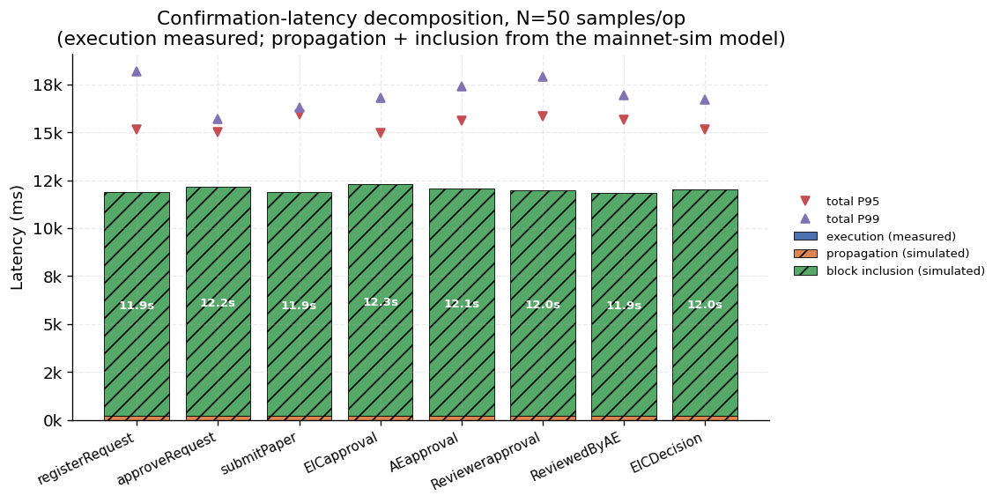
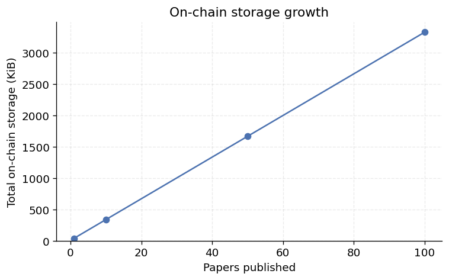

# Benchmark Report

_Generated: 2026-07-12T14:50:00.731Z · network: sepoliaFork_

## Methodology

Measurements run on the in-process Hardhat network in two passes: a **local** pass (fast, offline) and a **sepoliaFork** pass that forks real Sepolia state at the pinned block (see README / CHANGELOG). The EVM is deterministic, so gas-per-operation is identical across both — the fork validates the local numbers against real-network parameters rather than changing them. Latency, throughput, and scalability depend on block cadence and gas limit (12.242s block interval, 30,000,000 gas/block).

Sections 1 and 3 and the lifecycle are **dual-network** (`local` + `sepoliaFork` row-blocks); their per-operation gas tables are byte-for-byte identical across networks (Section 1), so the local measurements equal the real-Sepolia-state ones. Sections 2 and 4–7 are **local-only by design** — see the note in each. Tables are network-independent wherever gas-derived; wall-clock columns reflect local execution and are not cross-network meaningful. (This pass ran on `sepoliaFork`.)

Every CSV in this directory carries a `network` column with one row-block per network. Sections run independently via `npm run benchmark:<section>`; both networks via `npm run benchmark:all-networks`.

## 1. Gas per operation

### Deployment

| Contract | Gas used |
|---|---:|
| Auth | 3,344,851 |
| Main | 6,126,560 |
| Decision | 2,883,004 |

### Auth operations

| Operation | Gas used |
|---|---:|
| addJournalDirect | 299,014 |
| requestMember | 303,838 |
| approveRequest | 308,357 |
| denyRequest | 73,448 |

### Main + Decision pipeline

| Operation | Gas used |
|---|---:|
| getPaperInfo | 282,499 |
| sendToEIC | 363,466 |
| EICapproval | 655,497 |
| AEapproval | 655,564 |
| Reviewerapproval | 912,289 |
| ReviewedByAE | 477,449 |
| decisionGetPaperInfo | 745,340 |
| EICDecision | 865,034 |

## 2. Latency decomposition (composite mainnet-sim model)

Per-operation confirmation latency over 50 transactions, decomposed into **measured EVM execution** (wall-clock send→receipt on the in-process node) plus **simulated** network components:

- `propagation` = Gaussian(150 ms, σ 40 ms) [Box-Muller] + Exponential(mean 50 ms) queueing + 10% Pareto(scale 50, α 3) congestion spike
- `blockInclusion` = Gaussian(12,000 ms, σ 2,000 ms) — a 12 s ± 2 s inclusion wait, mean matching Sepolia's observed 12.242s block cadence (see Methodology)
- `total` = execution + propagation + blockInclusion

> **Honesty label.** Only `execution` is a measurement. `propagation` and `blockInclusion` are drawn from the parametric model above (network label `mainnet-sim`), with a seeded RNG (seed 42) so runs are reproducible. This is **not** measured mainnet/testnet latency.

| Operation | Component | Source | Mean (ms) | P95 (ms) | Min (ms) | Max (ms) |
|---|---|---|---:|---:|---:|---:|
| **registerRequest** | execution | measured | 1 | 2 | 1 | 3 |
|  | propagation | mainnet-sim | 200 | 327 | 99 | 401 |
|  | blockInclusion | mainnet-sim | 11,825 | 15,990 | 8,090 | 16,247 |
|  | total | composite | 12,027 | 16,156 | 8,249 | 16,428 |
| **approveRequest** | execution | measured | 2 | 3 | 1 | 4 |
|  | propagation | mainnet-sim | 201 | 385 | 64 | 398 |
|  | blockInclusion | mainnet-sim | 12,089 | 14,226 | 6,872 | 15,910 |
|  | total | composite | 12,292 | 14,352 | 7,142 | 16,111 |
| **submitPaper** | execution | measured | 3 | 4 | 2 | 6 |
|  | propagation | mainnet-sim | 210 | 332 | 114 | 422 |
|  | blockInclusion | mainnet-sim | 11,923 | 14,819 | 8,771 | 16,546 |
|  | total | composite | 12,136 | 15,023 | 9,061 | 16,796 |
| **EICapproval** | execution | measured | 2 | 4 | 1 | 4 |
|  | propagation | mainnet-sim | 205 | 309 | 116 | 318 |
|  | blockInclusion | mainnet-sim | 11,580 | 15,116 | 7,393 | 15,713 |
|  | total | composite | 11,787 | 15,331 | 7,593 | 15,934 |
| **AEapproval** | execution | measured | 2 | 3 | 1 | 4 |
|  | propagation | mainnet-sim | 216 | 358 | 98 | 385 |
|  | blockInclusion | mainnet-sim | 12,677 | 16,164 | 9,621 | 17,413 |
|  | total | composite | 12,894 | 16,306 | 9,802 | 17,623 |
| **Reviewerapproval** | execution | measured | 2 | 3 | 1 | 4 |
|  | propagation | mainnet-sim | 218 | 307 | 70 | 437 |
|  | blockInclusion | mainnet-sim | 11,819 | 15,735 | 7,646 | 16,080 |
|  | total | composite | 12,039 | 15,988 | 7,807 | 16,324 |
| **ReviewedByAE** | execution | measured | 2 | 2 | 1 | 2 |
|  | propagation | mainnet-sim | 215 | 369 | 75 | 379 |
|  | blockInclusion | mainnet-sim | 11,786 | 14,350 | 7,024 | 16,485 |
|  | total | composite | 12,003 | 14,628 | 7,201 | 16,679 |
| **EICDecision** | execution | measured | 4 | 7 | 3 | 8 |
|  | propagation | mainnet-sim | 212 | 334 | 96 | 379 |
|  | blockInclusion | mainnet-sim | 12,214 | 14,841 | 8,850 | 15,205 |
|  | total | composite | 12,430 | 15,062 | 9,121 | 15,367 |

Raw data: [latency.csv](./latency.csv)

## 3. Throughput

### Analytical (Sepolia block gas **target** 30M, 12s blocks)

Theoretical upper bound assuming a block contains only that operation. 30M gas is the EIP-1559 block **target**; blocks may transiently expand to the 60M hard limit (2x target), but the base-fee mechanism regulates sustained usage back to the target, so the target is the correct basis for a sustained-throughput ceiling (burst ceiling is 2x these figures).

| Operation | Gas | Ops/block | TPS |
|---|---:|---:|---:|
| addOrRequestMember | 303,838 | 98 | 8.01 |
| approveRequest | 308,357 | 97 | 7.92 |
| getPaperInfo | 282,499 | 106 | 8.66 |
| sendToEIC | 363,466 | 82 | 6.7 |
| EICapproval | 655,497 | 45 | 3.68 |
| AEapproval | 655,564 | 45 | 3.68 |
| Reviewerapproval | 912,289 | 32 | 2.61 |
| EICDecision | 865,034 | 34 | 2.78 |

### Empirical (local instant-mine sanity check)

- Operation: `submission (getPaperInfo + sendToEIC)`
- Submissions: 100 (two txs each)
- Blocks consumed: 200
- Wall-clock: 1076 ms
- Local TPS (instant-mine, no block-time floor): 92.94

Raw data: [throughput.csv](./throughput.csv)

## 4. Scalability

Full Auth->Main->Decision pipeline run for N papers.

> **Local-only, valid cross-network.** This sweep is run on the local network only. Its reported metrics (`totalGas`, `meanGasPerPaper`) are gas-derived, and Section 1 proves per-operation gas is byte-for-byte identical between `local` and `sepoliaFork`. Gas is EVM-deterministic, so a sum of identical per-op costs is itself identical — the fork would reproduce these numbers exactly. Only wall-clock differs, which on a fork measures the harness (block production is harness-controlled), not the network, so it is not a meaningful cross-network metric.

| N | Total gas | Mean gas / paper | Wall-clock (ms) | Mean ms / paper |
|---:|---:|---:|---:|---:|
| 1 | 4,957,138 | 4,957,138 | 14 | 14 |
| 10 | 48,310,651 | 4,831,065 | 156 | 16 |
| 50 | 241,002,371 | 4,820,047 | 799 | 16 |
| 100 | 481,860,021 | 4,818,600 | 1,672 | 17 |
| 500 | 2,408,765,221 | 4,817,530 | 12,622 | 25 |

Raw data: [scalability.csv](./scalability.csv)

## 5. State-growth scalability

For each K, the relevant data structure is pre-seeded with K entries (distinct synthetic addresses), then one more operation is measured. Flat columns indicate O(1) per-op cost regardless of state size; rising columns indicate an O(n) regression to investigate. Auth seeding grows the approved-members array via the JOURNAL direct-add path (post-P5, requests are strictly self-registered, so pending requests cannot be bulk-seeded); pipeline seeding queues K papers by distinct authors.

> **Local-only, valid cross-network.** Every column here is a gas measurement, and Section 1 proves per-operation gas is byte-for-byte identical between `local` and `sepoliaFork`. These O(1)/O(n) figures are therefore network-independent; the fork would reproduce them exactly.

| K | addOrRequestMember | approoveRequest | denyRequest | sendToEIC | EICapproval |
|---:|---:|---:|---:|---:|---:|
| 10 | 303,922 | 335,027 | 73,448 | 224,812 | 425,780 |
| 100 | 303,922 | 335,027 | 73,448 | 224,812 | 425,780 |
| 1000 | 303,922 | 335,027 | 73,448 | 224,812 | 425,780 |
| 5000 | 303,922 | 335,027 | 73,448 | 224,812 | 425,780 |

Raw data: [state_growth.csv](./state_growth.csv)

## 6. Parallel-load scalability

N distinct clients fire transactions concurrently (`Promise.all`), for N = 10 … 100.

- **registration** — N self-service membership requests. Parallel-safe (distinct state per client): the scalability curve of record.
- **submission** — N authors each stage + submit a paper (`getPaperInfo` + `sendToEIC`). **Not parallel-safe by design**: `getPaperInfo` stages into a single shared scratchpad (SECURITY.md §4.1), so exactly one `sendToEIC` succeeds and the remaining N−1 revert on the queue guard (`"Author already queued here"`). This phase is a **concurrency-safety result, not a throughput result**: pre-fix, the same workload silently corrupted the queue; post-fix the guards fail safe under maximal interleaving, verified by the queue-integrity column (EIC queue length == successful submissions).

> **Local-only, honestly labelled.** Instant-mine local node: this measures the contracts and node under concurrent load (nonce handling, guard correctness, harness throughput), not consensus throughput. The real-network ceiling is the analytical gas-based TPS in Section 3.

| N | Phase | Wall-clock (ms) | TPS | Mean tx (ms) | P95 tx (ms) | Max tx (ms) | Success | Queue intact |
|---:|---|---:|---:|---:|---:|---:|---:|---|
| 10 | registration | 14 | 714.29 | 14 | 14 | 14 | 10/10 | — |
| 10 | submission | 29 | 34.48 | 29 | 29 | 29 | 1/10 | ✅ |
| 20 | registration | 28 | 714.29 | 26 | 27 | 27 | 20/20 | — |
| 20 | submission | 46 | 21.74 | 46 | 46 | 46 | 1/20 | ✅ |
| 30 | registration | 52 | 576.92 | 50 | 52 | 52 | 30/30 | — |
| 30 | submission | 59 | 16.95 | 59 | 59 | 59 | 1/30 | ✅ |
| 40 | registration | 45 | 888.89 | 42 | 44 | 44 | 40/40 | — |
| 40 | submission | 75 | 13.33 | 75 | 75 | 75 | 1/40 | ✅ |
| 50 | registration | 61 | 819.67 | 58 | 60 | 60 | 50/50 | — |
| 50 | submission | 100 | 10 | 100 | 100 | 100 | 1/50 | ✅ |
| 60 | registration | 72 | 833.33 | 68 | 71 | 71 | 60/60 | — |
| 60 | submission | 119 | 8.4 | 119 | 119 | 119 | 1/60 | ✅ |
| 70 | registration | 79 | 886.08 | 75 | 78 | 78 | 70/70 | — |
| 70 | submission | 128 | 7.81 | 128 | 128 | 128 | 1/70 | ✅ |
| 80 | registration | 89 | 898.88 | 84 | 88 | 89 | 80/80 | — |
| 80 | submission | 151 | 6.62 | 151 | 151 | 151 | 1/80 | ✅ |
| 90 | registration | 105 | 857.14 | 99 | 105 | 105 | 90/90 | — |
| 90 | submission | 181 | 5.52 | 175 | 175 | 175 | 1/90 | ✅ |
| 100 | registration | 115 | 869.57 | 109 | 114 | 115 | 100/100 | — |
| 100 | submission | 188 | 5.32 | 188 | 188 | 188 | 1/100 | ✅ |

Raw data: [parallel_scalability.csv](./parallel_scalability.csv)

## 7. Storage growth (on-chain footprint)

N papers are pushed end-to-end, then the storage the contracts occupy is accounted slot-by-slot from actual on-chain state (walked via the paginated getters) using Solidity's storage-layout rules — inline vs. long strings, array length slots, live index-map entries, and Auth's struct-mirror mappings. Bytes = slots × 32.

Workload: realistic field lengths per submission — authorName 24 chars, email 29 chars, title 120 chars, abstract 1500 chars, ipfsLink 80 chars, reviewerComment 2500 chars, aeComment 1000 chars, decisionMessage 300 chars.

> **Cross-checked against the EVM.** For one full lifecycle, a `debug_traceTransaction` count of net SSTOREs (slots left non-zero) gives **1167 slots** vs. **1167** from the analytical accounting — an exact match. Storage layout is EVM-deterministic, so these figures are network-independent (local-only run, same rationale as Section 5).

**What is stored per paper is constant**: metadata strings plus the IPFS link — the manuscript itself lives off-chain (Pinata/IPFS), so the on-chain footprint does not depend on the PDF's size. Total storage therefore grows linearly while bytes/paper is flat; the slightly higher N=1 value is the one-time overhead (staging structs, array length slots) amortizing over more papers.

The pipeline archives a copy of the paper at every approval stage (`approvedByEIC`, `approvedByAE`, `reviewedByReviewer`, `reviewedByAE`) plus two copies in Decision (`Publishpaper`, `ReturnAuthor`) — the `copies/paper` column quantifies this write amplification.

| N | Total slots | Total bytes | Bytes/paper | Copies/paper | Auth bytes (fixed roles) |
|---:|---:|---:|---:|---:|---:|
| 1 | 1,223 | 39,136 | 37,344 | 6 | 1,792 |
| 10 | 10,799 | 345,568 | 34,378 | 6 | 1,792 |
| 50 | 53,359 | 1,707,488 | 34,114 | 6 | 1,792 |
| 100 | 106,559 | 3,409,888 | 34,081 | 6 | 1,792 |

Raw data: [storage_growth.csv](./storage_growth.csv)
