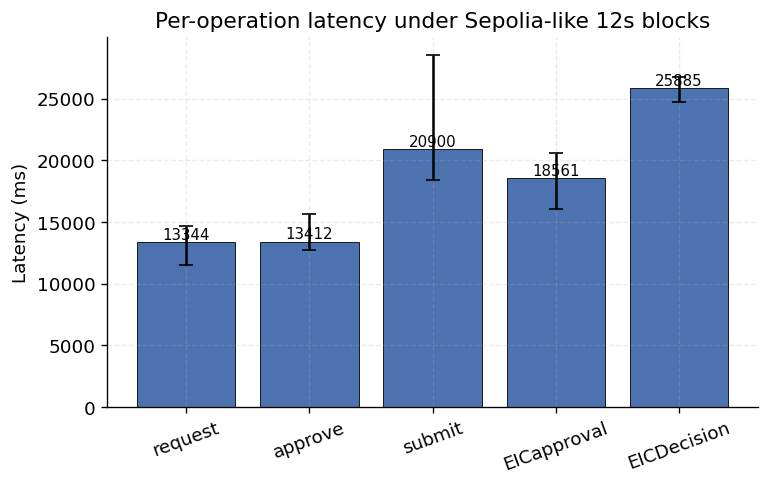
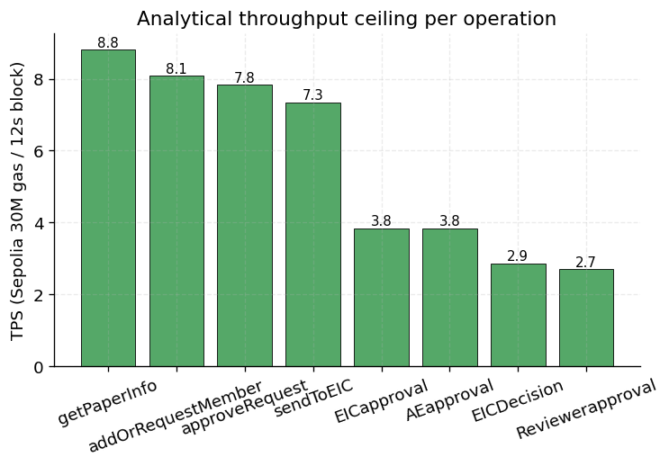
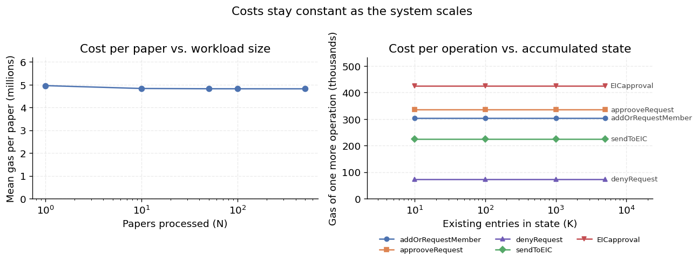
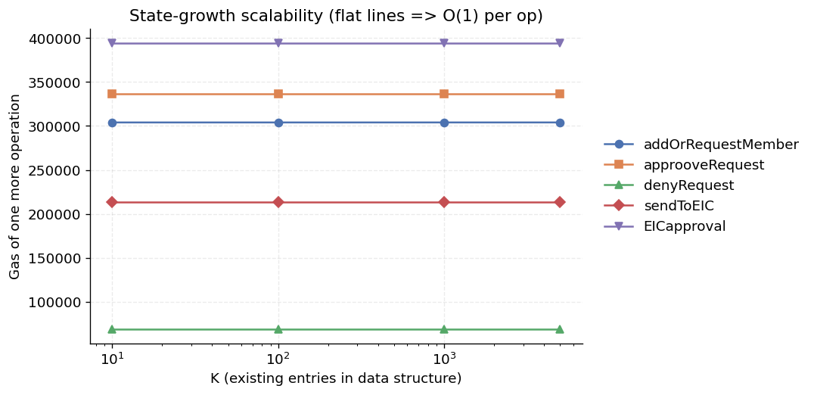

# Benchmark Report

_Generated: 2026-06-02T08:57:31.392Z · network: local_

## Methodology

Measurements run on the in-process Hardhat network in two passes: a **local** pass (fast, offline) and a **sepoliaFork** pass that forks real Sepolia state at the pinned block (see README / CHANGELOG). The EVM is deterministic, so gas-per-operation is identical across both — the fork validates the local numbers against real-network parameters rather than changing them. Latency, throughput, and scalability depend on block cadence and gas limit (12.242s block interval, 30,000,000 gas/block).

Both passes have been captured. **Sections 1–3 and the lifecycle are dual-network** (`local` + `sepoliaFork` row-blocks in their CSVs); the per-operation gas tables are byte-for-byte identical across networks (Section 1, and `figures/gas_network_compare.png`), confirming the local measurements equal the real-Sepolia-state ones. **Sections 4–5 are local-only by design** — see the note in each. The numeric tables below are network-independent wherever they are gas-derived; where a column is wall-clock (latency, scalability ms), it reflects local execution and is not a meaningful cross-network metric.

Every CSV in this directory carries a `network` column with one row-block per network; the figures (`figures/`) draw from the authoritative network (forked Sepolia where available). Sections run independently via `npm run benchmark:<section>`; both networks via `npm run benchmark:all-networks`.

## 1. Gas per operation

### Deployment

| Contract | Gas used |
|---|---:|
| Auth | 2,503,820 |
| Main | 5,171,573 |
| Decision | 1,996,712 |

### Auth operations

| Operation | Gas used |
|---|---:|
| addJournalDirect | 296,509 |
| requestMember | 301,333 |
| approveRequest | 310,518 |
| denyRequest | 45,708 |

### Main + Decision pipeline

| Operation | Gas used |
|---|---:|
| getPaperInfo | 276,390 |
| sendToEIC | 331,885 |
| EICapproval | 626,129 |
| AEapproval | 626,107 |
| Reviewerapproval | 882,729 |
| ReviewedByAE | 473,481 |
| decisionGetPaperInfo | 736,442 |
| EICDecision | 854,151 |

## 2. Latency under Sepolia-like 12s blocks

Each row is 5 samples on an in-process node with interval mining at 12.242s.

| Operation | Samples | Mean (ms) | Min (ms) | Max (ms) |
|---|---:|---:|---:|---:|
| request | 5 | 13879 | 12196 | 14990 |
| approve | 5 | 12778 | 12194 | 14968 |
| submit | 5 | 26735 | 25754 | 27276 |
| EICapproval | 5 | 12242 | 12200 | 12288 |
| EICDecision | 5 | 27167 | 26932 | 27341 |

Raw data: [latency.csv](./latency.csv)

## 3. Throughput

### Analytical (Sepolia 30M gas/block, 12s/block)

Theoretical upper bound assuming a block contains only that operation.

| Operation | Gas | Ops/block | TPS |
|---|---:|---:|---:|
| addOrRequestMember | 301,333 | 99 | 8.09 |
| approveRequest | 310,518 | 96 | 7.84 |
| getPaperInfo | 276,390 | 108 | 8.82 |
| sendToEIC | 331,885 | 90 | 7.35 |
| EICapproval | 626,129 | 47 | 3.84 |
| AEapproval | 626,107 | 47 | 3.84 |
| Reviewerapproval | 882,729 | 33 | 2.7 |
| EICDecision | 854,151 | 35 | 2.86 |

### Empirical (local instant-mine sanity check)

- Operation: `sendToEIC`
- Transactions: 100
- Blocks consumed: 100
- Wall-clock: 127 ms
- Local TPS (instant-mine, no block-time floor): 787.4

Raw data: [throughput.csv](./throughput.csv)

## 4. Scalability

Full Auth->Main->Decision pipeline run for N papers.

> **Local-only, valid cross-network.** This sweep is run on the local network only. Its reported metrics (`totalGas`, `meanGasPerPaper`) are gas-derived, and Section 1 proves per-operation gas is byte-for-byte identical between `local` and `sepoliaFork`. Gas is EVM-deterministic, so a sum of identical per-op costs is itself identical — the fork would reproduce these numbers exactly. Only wall-clock differs, which on a fork measures the harness (block production is harness-controlled), not the network, so it is not a meaningful cross-network metric.

| N | Total gas | Mean gas / paper | Wall-clock (ms) | Mean ms / paper |
|---:|---:|---:|---:|---:|
| 1 | 4,807,314 | 4,807,314 | 28 | 28 |
| 10 | 46,806,930 | 4,680,693 | 277 | 28 |
| 50 | 233,481,330 | 4,669,627 | 1,060 | 21 |
| 100 | 466,817,330 | 4,668,173 | 1,841 | 18 |
| 500 | 2,333,549,330 | 4,667,099 | 10,125 | 20 |

Raw data: [scalability.csv](./scalability.csv)

## 5. State-growth scalability

For each K, the relevant data structure is pre-seeded with K entries (distinct synthetic addresses), then one more operation is measured. Flat columns indicate O(1) per-op cost regardless of state size; rising columns indicate an O(n) regression to investigate.

> **Local-only, valid cross-network.** Every column here is a gas measurement, and Section 1 proves per-operation gas is byte-for-byte identical between `local` and `sepoliaFork`. These O(1)/O(n) figures are therefore network-independent; the fork would reproduce them exactly.

| K | addOrRequestMember | approoveRequest | denyRequest | sendToEIC | EICapproval |
|---:|---:|---:|---:|---:|---:|
| 10 | 303,989 | 336,960 | 69,072 | 213,238 | 394,518 |
| 100 | 303,989 | 336,960 | 69,072 | 213,238 | 394,518 |
| 1000 | 304,001 | 336,960 | 69,072 | 213,238 | 394,518 |
| 5000 | 304,001 | 336,960 | 69,072 | 213,238 | 394,518 |

Raw data: [state_growth.csv](./state_growth.csv)
